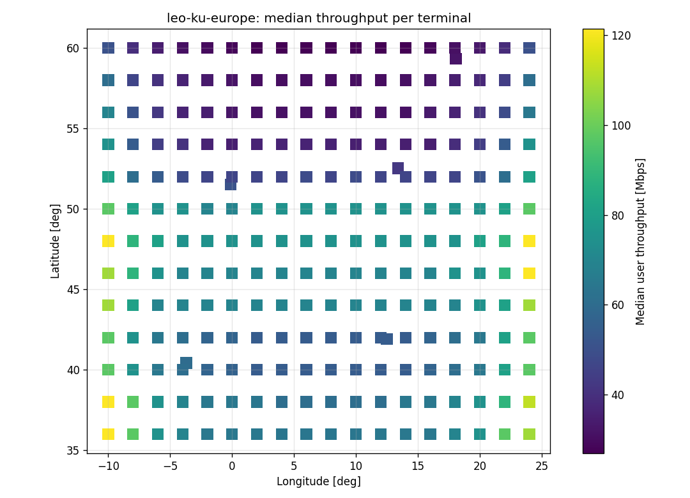

# E2EPS - End-to-End Performance Simulator

Physics-level simulator for satellite constellation performance, part of the wider Digital Twin tool suite.

E2EPS estimates **capacity, user throughput, availability and latency** by modelling orbital dynamics, line-of-sight geometry, dynamic RF link budgets and coverage - instead of packet-level network transport.

## Deliverables

| Deliverable | Location |
|---|---|
| 1. Software architecture diagram (E2EPS) | [docs/architecture.md](docs/architecture.md) |
| 2. Workflow diagram + data exchanged | [docs/workflow.md](docs/workflow.md) |
| 3. Solutions architecture (Digital Twin) | [docs/solutions-architecture.md](docs/solutions-architecture.md) |
| 4. Implemented modules + input/output defence | [docs/module-io.md](docs/module-io.md) |
| Assumptions (A1-A20) | [docs/assumptions.md](docs/assumptions.md) |
| Questions for Engineering teams | [docs/questions.md](docs/questions.md) |
| Performance benchmark | [benchmarks/results.md](benchmarks/results.md) |
| Sample results | [docs/results/](docs/results/) |

**Implemented modules:** Module A - Geometry & Visibility Engine (`e2eps/geometry`), Module B - RF Link Budget Engine (`e2eps/rf`). Orbit propagation, capacity allocation, latency, KPIs and CLI are included as lightweight supporting modules so the two can run end to end.


## Quick start

```bash
python -m venv .venv
.venv\Scripts\activate          # Linux/macOS: source .venv/bin/activate
pip install -e ".[dev]"
pytest -q                       # 56 tests

python -m e2eps -v run scenarios/leo_ku_europe.yaml --out output
python -m e2eps run scenarios/leo_ku_europe.yaml --rain-rate 50 --out output/rain
python -m e2eps link-budget scenarios/leo_ku_europe.yaml --elevation 25
```

### Executable

```powershell
.\build_exe.ps1                                  # -> dist\e2eps\e2eps.exe
dist\e2eps\e2eps.exe run dist\e2eps\scenarios\leo_ku_europe.yaml --out output
```

Linux/macOS: `./build_exe.sh`. The submission ZIP (source + Git history + executable) is built with `.\make_submission.ps1`.

> **Windows: "script is not digitally signed" error**
> PowerShell blocks scripts that came from a downloaded ZIP. Run one of these first:
>
> ```powershell
> # Option 1 - unblock the scripts (permanent)
> Unblock-File .\build_exe.ps1, .\make_submission.ps1
>
> # Option 2 - allow scripts for the current terminal only
> Set-ExecutionPolicy -Scope Process -ExecutionPolicy Bypass
> ```
>
> Or skip the scripts and build directly:
>
> ```powershell
> pyinstaller --noconfirm --clean --name e2eps --onedir --collect-submodules e2eps --exclude-module tkinter run_e2eps.py
> Copy-Item -Recurse -Force scenarios dist\e2eps\scenarios
> ```

## Outputs

| File | Content |
|---|---|
| `system_kpis.json` | Availability, throughput P5/P50/P95, latency, delivered capacity, active satellites, runtime per stage |
| `terminal_kpis.csv` | Same KPIs per terminal + coverage depth and handovers/hour |
| `system_timeseries.csv` | System KPIs per time step |
| `*.png` | Coverage map, throughput CDF, MODCOD usage, capacity over time, single-terminal timeline |

## Reference results

`scenarios/leo_ku_europe.yaml`: 528 satellites (550 km, 53 deg), 239 terminals over Europe, 7 gateways, Ku-band, 6 h at 30 s.

| KPI | Clear sky | Rain 50 mm/h |
|---|---:|---:|
| Availability | 100% | 100% |
| User throughput P5 / P50 / P95 | 28 / 61 / 139 Mbps | 9 / 40 / 92 Mbps |
| One-way latency mean / P95 | 19.9 / 21.2 ms | 19.9 / 21.2 ms |
| Delivered capacity over Europe | 16.9 Gbps | 10.8 Gbps |
| Runtime (91 M satellite-terminal pairs) | 3.3 s | 3.3 s |



## Design decisions

- **Array contracts** - modules exchange NumPy arrays shaped `(time, satellite, ground)`, no per-object Python loops.
- **Geometry as BLAS dot products** - ~3x faster and ~3x less memory than broadcasting, ~90-190x faster than a loop.
- **Time chunking** - memory depends on chunk size, not simulation length; chunks are independent, so they can run in parallel (Dask/Ray) later.
- **Pluggable models** - propagator, MODCOD table and allocation policy sit behind small interfaces (SGP4, real schedulers, DVB-S2X can drop in).
- **Config-driven and strict** - all physics parameters in YAML, validated by Pydantic; unknown keys fail loudly.

## Limitations and next steps

| Limitation | Next step |
|---|---|
| One channel per satellite, no beams | Beam layout + per-beam capacity (needs payload input, Q8/Q19) |
| C/N only, no interference | C/(N+I) with frequency reuse plan (Q7) |
| User downlink only | Reuse Module B for uplink and feeder links |
| Fixed rain rate everywhere | ITU-R P.837 climate maps, time-correlated rain fields |
| Single machine | Parallel chunks with Dask/Ray; REST/gRPC service for Digital Twin integration |
| Analytic Walker-Delta orbits | SGP4 / operational ephemeris behind the same propagator interface |

## Repository layout

```
docs/          diagrams, assumptions, questions, module I/O, sample results
e2eps/
  config/      scenario schema and loader
  orbit/       Walker-Delta propagator (J2)
  geometry/    Module A - Geometry & Visibility Engine
  rf/          Module B - RF Link Budget Engine
  capacity/    satellite selection and bandwidth sharing
  latency/     propagation latency model
  kpi/         KPI aggregation
  simulation.py  chunked orchestrator
  cli.py       command-line interface
scenarios/     reference and test scenarios
tests/         unit and end-to-end tests
benchmarks/    geometry benchmark + results
```
